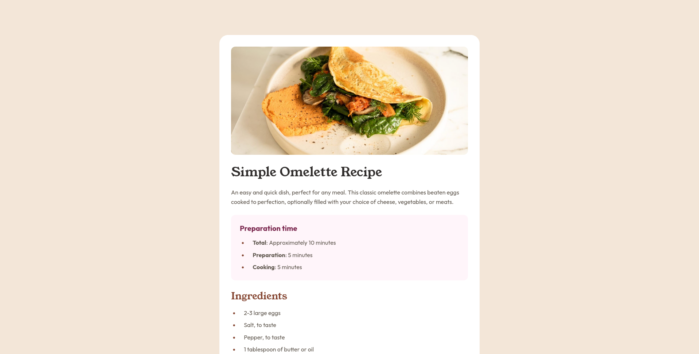

# Frontend Mentor - Recipe page solution

This is a solution to the [Recipe page challenge on Frontend Mentor](https://www.frontendmentor.io/challenges/recipe-page-KiTsR8QQKm). Frontend Mentor challenges help you improve your coding skills by building realistic projects.

## Overview

### Screenshot

## My process

### Build with

- Semantic HTML5 markup
- CSS custom properties
- Flexbox
- CSS Grid

### What I learned

I learned how to style list markers and how to use and style tables. I also learned how to hide table caption so that only screen readers are able to see it for accessibility purposes.

### Useful resources

- [MDN article on ::marker](https://developer.mozilla.org/en-US/docs/Web/CSS/::marker) - This helped me with styling bullet points and numbers in a list.
- [MDN article on tables](https://developer.mozilla.org/en-US/docs/Web/HTML/Reference/Elements/table) - This helped me with building the nutrition table.
